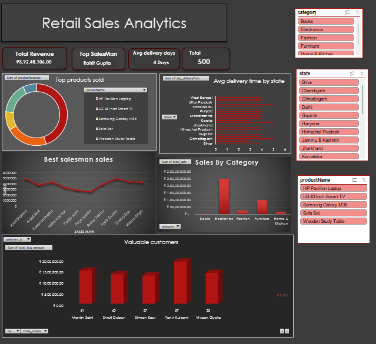

# 📊 Retail Sales Analytics | SQL & Excel Business Intelligence Project

A complete end-to-end Retail Sales Analytics project demonstrating database design, SQL data cleaning, business analysis, and interactive Excel dashboard development.

---

# 📑 Table of Contents

- [Overview](#-overview)
- [Problem Statement](#-problem-statement)
- [Dataset](#-dataset)
- [Tools & Technologies](#-tools--technologies)
- [Methods](#-methods)
- [Key Insights](#-key-insights)
- [Dashboard](#-dashboard)
- [Results & Conclusion](#-results--conclusion)
- [Future Work](#-future-work)
- [Author & Contact](#-author--contact)

---
# 📖 Overview

Retail businesses generate large volumes of transactional data every day. However, raw data often contains inconsistencies, duplicate values, and formatting issues that make analysis difficult.

This project simulates a real-world retail environment by designing a normalized SQL database, cleaning messy data, answering business-critical questions using SQL, and visualizing key performance metrics through an interactive Excel dashboard.

The project demonstrates the complete analytics workflow—from raw data to actionable business insights.

---

# 🎯 Problem Statement

Business stakeholders require reliable insights to monitor sales performance, identify high-performing products, understand customer purchasing behavior, and evaluate salesperson performance.

The objective of this project is to transform raw retail transaction data into meaningful business intelligence that supports informed decision-making.

---

# 📂 Dataset

The dataset was manually designed to simulate a real-world retail sales database.

### Database Tables

- Customers (50 Records)
- Products (20 Records)
- SalesPerson (10 Records)
- Orders (500 Records)
- OrderDetails (1000 Records)

The dataset includes customer demographics, product information, order transactions, payment methods, delivery information, discounts, and returns.

Several intentional data quality issues were introduced to perform SQL-based data cleaning.

---

# 🛠️ Tools & Technologies

| Tool | Purpose |
|------|---------|
| MySQL | Database Design & SQL Analysis |
| Microsoft Excel | Dashboard Development |
| Power Pivot | Data Modeling |
| Pivot Tables | Data Analysis |
| Pivot Charts | Visualization |

---

# ⚙️ Methods

The project was completed in the following phases:

### 1. Database Design
- Created a normalized relational database
- Defined primary and foreign key relationships

### 2. Data Generation
- Created realistic retail sales data
- Simulated customer orders and transactions

### 3. Data Cleaning
- Removed leading and trailing spaces
- Standardized gender values
- Standardized payment methods
- Corrected product categories
- Validated age values
- Improved overall data consistency

### 4. Business Analysis
Performed SQL analysis using:
- JOINs
- Aggregate Functions
- GROUP BY
- ORDER BY
- Common Table Expressions (CTEs)
- Filtering and Sorting

### 5. Dashboard Development
- Imported cleaned data into Excel
- Built relationships using Power Pivot
- Created Pivot Tables
- Developed interactive Pivot Charts
- Designed an executive dashboard

---

# 📁 Folder Structure

```
Retail-Sales-Analytics/
│
├── 📂 Dataset/
│   ├── Customers.csv
│   ├── Products.csv
│   ├── Orders.csv
│   ├── OrderDetails.csv
│   └── SalesPerson.csv
│
├── 📂 data_Excel_tables/
│   ├── AverageDeliveryTime.csv
│   ├── BestSalesperson.csv
│   ├── MostPopularPaymentMethod.csv
│   └── ReturnedProductsByCategory.csv
├── analysis_queries.sql
├── Retail_Sales_Analytics_Dashboard.xlsx
│
├── 📂 Images/
│   └── Dashboard.png
│
├── README.md
```
The repository is organized to separate the raw datasets, SQL scripts, Excel dashboard, and project documentation for easier navigation and maintenance.

---

# 📈 Key Insights

The project answers the following business questions:

- Total Revenue generated
- Revenue contribution by product category
- Monthly sales trend analysis
- Top-performing products
- Highest revenue-generating customers
- Salesperson performance comparison
- Revenue distribution by payment method
- State-wise sales performance
- Order return analysis
- Category-wise revenue contribution using CTE

---

# 📊 Dashboard

The Excel dashboard provides an interactive view of the business performance through:

### KPI Cards

- Total Revenue
- Total Orders
- Total Customers
- Products Sold
- Average Delivery Days

### Visualizations

- Revenue by Category
- Monthly Revenue Trend
- Top Products
- Top Customers
- Salesperson Performance
- Revenue by State
- Payment Method Distribution

> **Dashboard Preview**



---

# 📌 Results & Conclusion

The project successfully demonstrates how SQL and Excel can be integrated to transform raw transactional data into actionable business insights.

By designing a relational database, cleaning inconsistent data, performing analytical SQL queries, and building an interactive dashboard, the project highlights a practical end-to-end analytics workflow commonly used in business environments.

The resulting dashboard enables users to monitor sales performance, identify revenue-driving products, evaluate customer behavior, and support data-driven decision-making.

---

# 🚀 Future Work

Possible enhancements include:

- Building the dashboard in Power BI
- Automating data refresh using Power Query
- Adding customer segmentation (RFM Analysis)
- Developing sales forecasting models
- Integrating SQL views for automated reporting
- Expanding the dataset with multiple years of sales data

---

# 👨‍💻 Author & Contact

**Robin Bisht**

GitHub: *https://www.github.com/Robinbisht394*

LinkedIn: *https://www.linkedin.com/in/robin-singh*

Email: *robinbisht394@gmail.com*